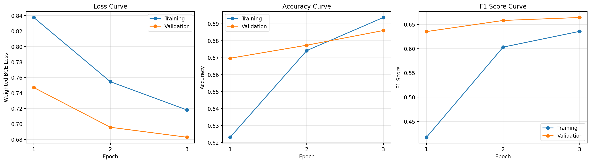
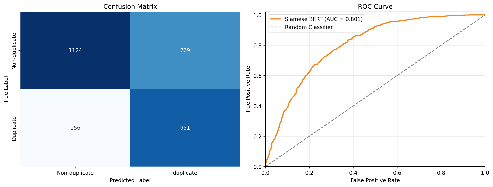

# Siamese BERT for Quora Question Similarity

A compact, reproducible NLP project for detecting semantically duplicate questions. Two questions are encoded by the same BERT model, their sentence embeddings are compared with an element-wise L1 distance, and a small neural classifier predicts whether they express the same intent.

## Results

The reported experiment uses a stratified 30,000-pair subset of the Quora Question Pairs dataset.

| Metric | Test score |
|---|---:|
| Accuracy | 0.6917 |
| Precision | 0.5529 |
| Recall | 0.8591 |
| F1 | 0.6728 |
| ROC-AUC | 0.8008 |





The model favors recall because the loss gives additional weight to the minority duplicate class. This catches most duplicate questions, at the cost of more false positives.

## Architecture

```text
Question 1 ──> Shared BERT ──> Mean pooling ──┐
                                               ├─> |u - v| ─> MLP ─> duplicate probability
Question 2 ──> Shared BERT ──> Mean pooling ──┘
```

- Encoder: `prajjwal1/bert-tiny`
- Sequence length: 48 tokens
- Training sample: 24,000 pairs
- Validation sample: 3,000 pairs
- Test sample: 3,000 pairs
- Loss: weighted binary cross-entropy with logits
- Optimizer: AdamW with separate encoder and classifier learning rates

## Repository structure

```text
.
├── notebooks/
│   └── siamese_bert_quora_similarity.ipynb
├── results/
│   ├── evaluation_results.png
│   └── training_curves.png
├── src/
│   ├── __init__.py
│   └── model.py
├── .gitignore
├── README.md
└── requirements.txt
```

## Setup

Python 3.9 or newer is recommended.

```bash
python -m venv .venv
source .venv/bin/activate
pip install -r requirements.txt
```

Open the notebook and run it from top to bottom. The notebook downloads the dataset on first use and stores it under `data/`, which is excluded from Git.

## Dataset

The project uses the public Quora Question Pairs release, containing approximately 404,000 labeled question pairs. The original data is not included in this repository. Use of the dataset is subject to the Quora dataset terms.

## Notes

- The compact BERT encoder keeps training practical on Apple Silicon and CPU-only machines.
- The full dataset can be used by increasing `SAMPLE_SIZE`, but training will take longer.
- Model checkpoints are excluded to keep the repository small and reproducible.
